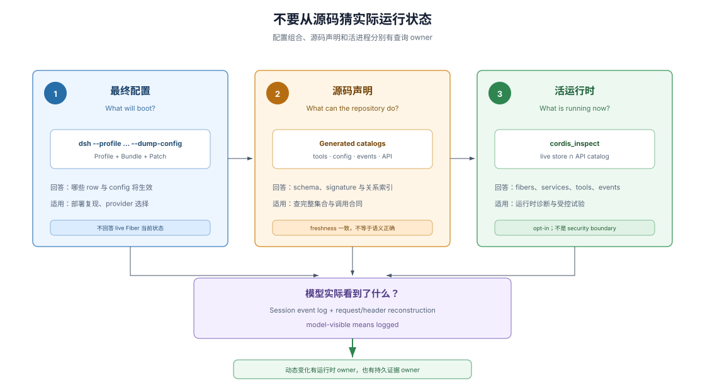

# 06 · 动态可检查性：询问实际运行状态

## 源码只能说明可能性

静态 import 和 package tree 能说明仓库可能提供哪些能力，却不能单独回答某台机器、某个 profile 或某个 session 实际加载了什么。Profile、Bundle、Patch、Preset、scope 和 plugin lifecycle 会共同改变活运行时。

Inspectability（可检查性）要求系统提供查询入口，让 agent 用当前状态验证假设，而不是只从源码结构猜部署结果。

## 查询一：最终配置树是什么

> To see the tree your machine actually boots: `dsh --profile web --dump-config`
>
> — DSH [`docs/architecture.md`](https://github.com/deepseek-ai/deepseek-harness/blob/528c682e061696f5a160f363f236ecbf53cbd006/docs/architecture.md#profiles-and-bundles)。这条命令回答 profile、bundle 和 patch 叠加后的实际 boot 配置，而不是源码中可能出现的所有插件。

当 provider 是否生效、某个 config 为什么被替换或一个 row 从哪里进入系统不清楚时，最终配置树比扫描 import 更接近问题对象。它也为 bug report 提供可复现输入。

## 查询二：仓库声明了哪些合同

生成的 tool catalog、config catalog、persistence catalog、event producer/consumer map、capability graph 和 Cordis API reference 把源码声明变成可搜索索引。Freshness gate 会在源码变化而生成物未同步时失败。

这些 catalog 回答“仓库声明了什么”，不是“当前进程正运行什么”。它们适合查工具 schema、事件 dispatch mode、配置字段和 service signature；实际 provider 与 Fiber 状态仍要问活运行时。

## 查询三：当前进程里有什么

DSH 的 opt-in `@deepseek-ai/dsh-tool-cordis` 提供 `cordis_inspect`。它把 live service store（活服务存储）与生成 API catalog 求交：运行状态来自当前进程，方法签名与 JSDoc 来自源码生成物。

> `src/inspect.ts` intersects that catalog with the LIVE service store: what is RUNNING comes from the store, what each service CAN DO comes from the catalog [...].
>
> — DSH [`@deepseek-ai/dsh-tool-cordis` README](https://github.com/deepseek-ai/deepseek-harness/blob/528c682e061696f5a160f363f236ecbf53cbd006/packages/extensions/tool-cordis/README.md#where-the-api-report-comes-from)。这段原文区分了运行时事实与编译期 API 事实的 owner。

`cordis_inspect` 可以报告 live fibers、services、tools、API、events 和当前 session 定义的 dynamic packages。宽查询保持摘要，精确名称查询才附带完整合同，从而兼顾探索和上下文成本。

## 从查询进入可撤销试验

固定基线的 package contract 还提供 `cordis_define`、`cordis_run`、`cordis_stop` 和 `cordis_undefine`：agent 可以定义一个只存在于当前 DSH 进程的 dynamic package，运行 host/browser halves，再停止或忘记它。

这些动作适合验证“按这个 Plugin 方式注册会发生什么”，不等于修改仓库：dynamic package 不创建文件、不改变 `cordis.yml`、不自动晋升为正式插件，也不跨 DSH restart 保留。需要永久保存时，仍要回到普通开发流程完成源码、文档、测试和决策记录。

## 动态能力不是安全边界

Tool Cordis 的 vm 隔离 accidental global pollution（意外全局污染），Context façade 隐藏 framework internals，但暴露的 `ctx.shell`、`ctx.fs` 和 `ctx.web` 仍具有真实运行时权限。DSH 将它定义为 opt-in development tool，并要求像 bash access 一样对待。

因此“可试验”不表示“不需要授权”，可撤销 plugin contribution 也不表示外部副作用能够事务回滚。Dynamic package 的生命周期和部署安全是两个不同问题。

## 动态变化仍要可重建

Plugin set 可以变化，但任何真正进入模型请求的 tool schema、prompt section 或消息都必须通过 session event 与 request header 重建。`model-visible means logged` 把运行时动态和 durable evidence（持久证据）连接起来。

这使 agent 能分别询问三个问题：配置会加载什么、源码声明什么、当前进程运行什么；如果变化影响模型，再从日志核对模型实际看到了什么。

## 证据入口

- DSH [`docs/architecture.md`](https://github.com/deepseek-ai/deepseek-harness/blob/528c682e061696f5a160f363f236ecbf53cbd006/docs/architecture.md)：ordered config layers、`--dump-config`、session log 和 model-visible means logged。
- DSH [`@deepseek-ai/dsh-tool-cordis` README](https://github.com/deepseek-ai/deepseek-harness/blob/528c682e061696f5a160f363f236ecbf53cbd006/packages/extensions/tool-cordis/README.md)：五个 model-facing tools、dynamic package 生命周期、信任边界和 live/catalog 交集。
- DSH [`docs/tool-catalog.md`](https://github.com/deepseek-ai/deepseek-harness/blob/528c682e061696f5a160f363f236ecbf53cbd006/docs/tool-catalog.md)：生成的工具 schema 索引。
- DSH [`docs/config-catalog.md`](https://github.com/deepseek-ai/deepseek-harness/blob/528c682e061696f5a160f363f236ecbf53cbd006/docs/config-catalog.md)：生成的配置字段索引。
- DSH [`docs/event-producer-consumer.md`](https://github.com/deepseek-ai/deepseek-harness/blob/528c682e061696f5a160f363f236ecbf53cbd006/docs/event-producer-consumer.md)：生成的事件 producer、consumer 和 dispatch mode 索引。
